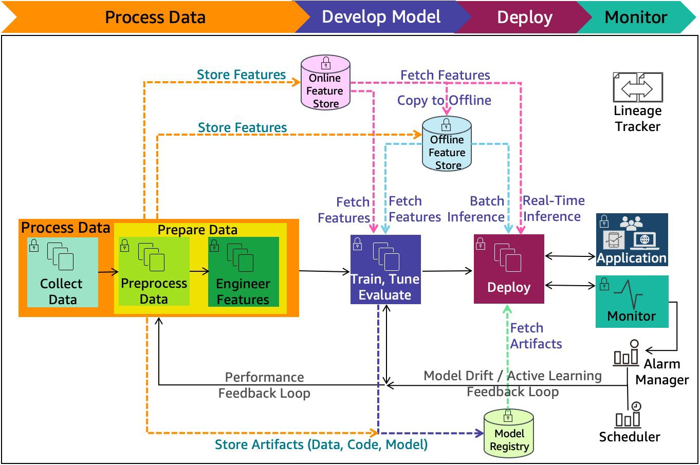

# MachineLearningEngineering
Neste repositório vamos estudar todos os componentes presentes nesta imagem:

Material de apoio: [AWS Well-Architected Framework](https://docs.aws.amazon.com/pdfs/wellarchitected/latest/framework/wellarchitected-framework.pdf#welcome)
### 1. Process Data
- Tratamentos

### 2. Feature Store
    - Offline
    - Online
- Feature Versioning
- Feature Lineage
- Feature Freshness
Use o `feast`

por que existe
diferença offline x online
point-in-time join

### 3. Training
Treinamento de modelos

### 4. Experiment Tracking
- MLFlow

### 5. Model Registry

### 6. Deploy
- FastAPI
- Docker
- Docker Compose
- Orquestração Kubernets

### 7. Batch Inference
- Airflow

### 8. Real-time Inference
- FastAPI
- Docker
- Redis

### 9. CI/CD
Veja como fazer usando o github

### 10. Monitoring
- Evidently AI
- Grafana
- Prometheus

Drift
Performance
Alertas

### 11. Feadback Loop
- Champion vs Challenger
- Retraining

# Tópicos
- Engenharia de dados e reprodutibilidade
- Feature Store (Feast)
- DVC (Data Version Control)
- MLFlow
- Evidently AI

- Deploy via FastAPI
- Containerização
- CI/CD/CT (continuos training) /CM (continous monitoring)
- Logging

- Kubernetes
- Sagemaker
